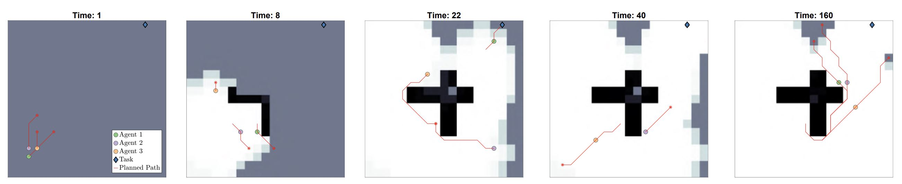

# Coordinated Multi-Agent Exploration, Rendezvous, & Task Allocation in Unknown Environments with Limited Connectivity

This is a repository for the results from the paper titled "Coordinated Multi-Agent Exploration, Rendezvous, & Task Allocation in Unknown Environments with Limited Connectivity" by Lauren Bramblett, Rahul Peddi, and Nicola Bezzo

## Installation

Clone repository:
```
git clone https://github.com/laurenbramblett/Coordinated-Multi-Agent-Exploration-Rendezvous-Task-Allocation-in-Unknown-Environments.git
```

## Usage

* Running "mainFSM_run.m" will run all relevant functions given the user defined inputs
	* Make sure to change any pieces such as agent locations, maps, or tuning parameters in lines 7-67

Below is a picture of the simulation in action:



## Notes

If using this code, please cite our paper:

Bramblett, Lauren, Rahul Peddi, and Nicola Bezzo. "Coordinated Multi-Agent Exploration, Rendezvous, & Task Allocation in Unknown Environments with Limited Connectivity." 2022 IEEE/RSJ International Conference on Intelligent Robots and Systems (IROS). IEEE, 2022.

Bibtex:
```
@inproceedings{bramblett2022coordinated,
  title={Coordinated Multi-Agent Exploration, Rendezvous, \& Task Allocation in Unknown Environments with Limited Connectivity},
  author={Bramblett, Lauren and Peddi, Rahul and Bezzo, Nicola},
  booktitle={2022 IEEE/RSJ International Conference on Intelligent Robots and Systems (IROS)},
  pages={12706--12712},
  year={2022},
  organization={IEEE}
}
```

